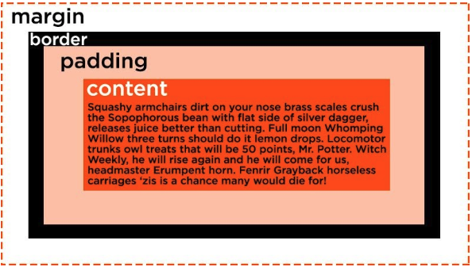

I've been studying CSS recently so I can make my blog look a bit more appealing. One of the things I've come across is `margin` and `padding`. I was pretty confused when I saw these cause they seemed to do the same exact thing. Turns out they don't! 

I've come across a few really good examples as well as some pretty funny ones and I wanted to share them.

[pluralsight](https://www.pluralsight.com/blog/creative-professional/whats-difference-margin-padding) has a really good example using a box model which seems to be the easiest way to explain the difference.

I've also come across a couple other examples that I really love. There is this one where [Kelly Vaughn](https://twitter.com/kvlly) shows the difference by sitting in a cardboard box! 

<blockquote class="tw-align-center twitter-tweet">
I&#39;m a box model <a href="https://t.co/b1DDNWPIy1">pic.twitter.com/b1DDNWPIy1</a>
&mdash; Kelly Vaughn 🐞 (@kvlly) <a href="https://twitter.com/kvlly/status/1159263383058862081?ref_src=twsrc%5Etfw">August 8, 2019</a></blockquote> 

It's great because you can clearly see the difference between padding and margin where the padding is the spacing between the content, Kelly, and the box where the margin is the spacing between the box and the and the edges of the picture.

The last example that was shared to me was by the twitter user @EriPDev. 

> "The border is my personal bubble. Padding is how much space I  need inside my bubble, margin is how much I need everyone to back TF up off me"

I'd love to give her more credit but her twitter has been deleted since this tweet was posted. But I really do love this example. It's just a funny example of the difference between padding vs margin. 